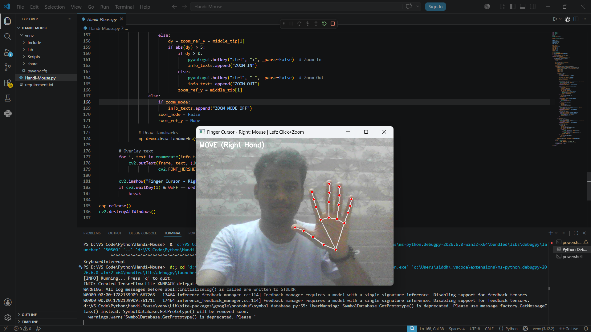
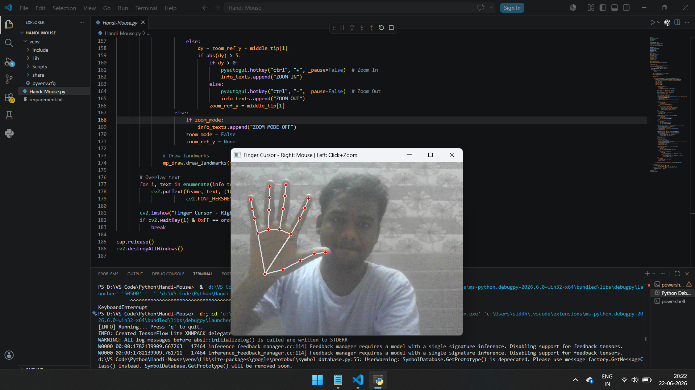

# Handi-Mouse: AI-Based Gesture Control System

Handi-Mouse is a real-time, computer vision-driven system that allows users to control their computer's mouse and execute commands using natural hand gestures. By leveraging **Python**, **OpenCV**, and **MediaPipe**, the application maps complex tracking coordinates to system-level inputs using **PyAutoGUI**, entirely eliminating the need for physical hardware peripherals.

---

## 📸 System Interface & Detection

The system independently tracks and processes inputs from both hands to prevent command conflicts and maximize desktop control.

| 🛑 Right Hand Tracking (Navigation & Editing) | 👈 Left Hand Tracking (Execution & Sizing) |
| :---: | :---: |
|  |  |

---

## 📦 Different Python Packages
pip install numpy==1.26.4
pip install opencv-python==4.9.0.80
pip install pyautogui==0.9.54
pip install protobuf==4.25.3
pip install mediapipe==0.10.14

---

## ✨ Features & Gesture Map

### 🛑 Right Hand Features
* **Cursor Movement:** Move your right hand. The cursor utilizes an exponential smoothing algorithm ($0.75$) to reduce trembling and keep motion fluid.
* **Right Click:** Pinch your **Thumb + Index finger** together.
* **Scroll Mode:** Pinch your **Thumb + Middle finger**. Drag up or down to scroll documents or webpages dynamically.
* **Text Selection (Click & Drag):** Pinch your **Thumb + Ring finger** to engage a mouse-down state; release to finish selecting text.
* **Copy (Ctrl + C):** Pinch your **Thumb + Pinky finger**.
* **Paste (Ctrl + V):** Pinch your **Thumb + Index + Middle fingers** simultaneously.

### 👈 Left Hand Features
* **Left Click:** Pinch your **Thumb + Index finger** together.
* **Zoom Control:** Pinch your **Thumb + Middle finger** together. Moving your hand upwards zooms in (`Ctrl + +`), while moving downwards zooms out (`Ctrl + -`).

---

## 🛠️ Installation & Setup

### 1. Set Up a Virtual Environment (Recommended only on Windows)
If you are on Windows, it is highly recommended to isolate your dependencies inside a virtual environment before running the project:
```bash
# Create a virtual environment
python -m venv venv

# Activate the virtual environment
venv\Scripts\activate
